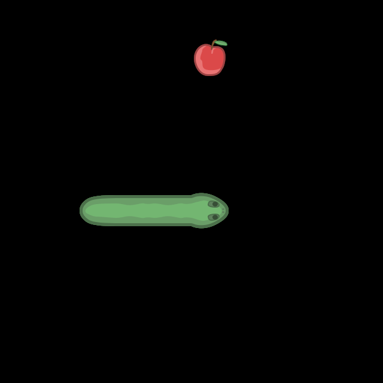
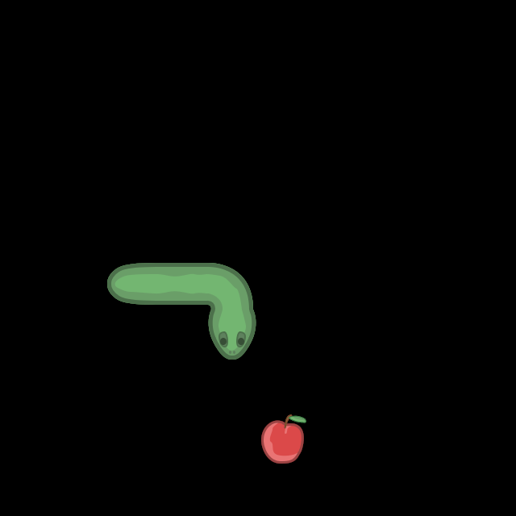
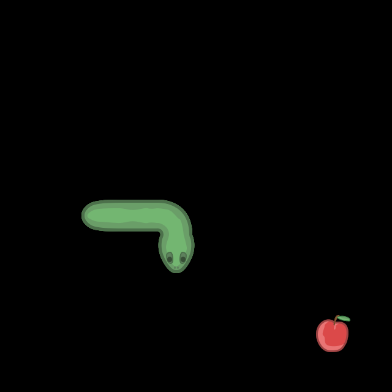
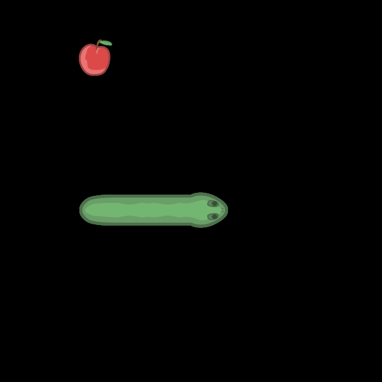
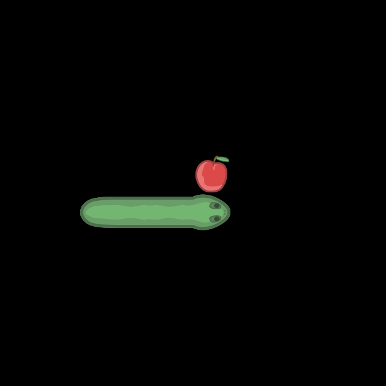
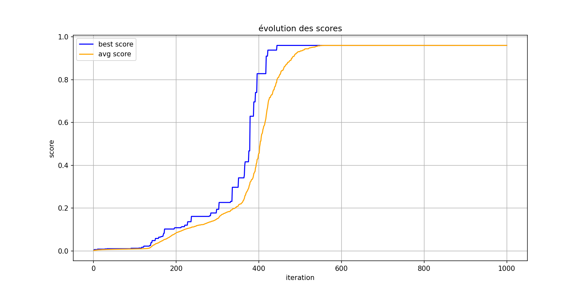
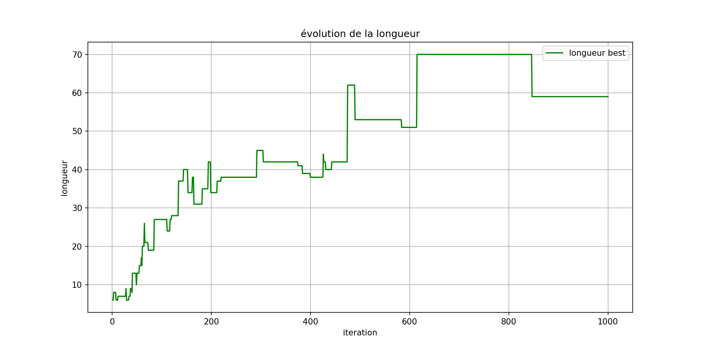

# Snake

## Démonstration

### Évolution de l'apprentissage

| Itération 100 | Itération 250 | Itération 400 |
|:-------------:|:-------------:|:-------------:|
|  |  |  |

| Itération 600 | Itération 750 | Itération 1000 |
|:-------------:|:-------------:|:--------------:|
|  |  |  |

### Résultat final


### Graphiques d'évolution

| Évolution des scores | Évolution de la longueur |
|:--------------------:|:------------------------:|
|  |  |

## Architecture du projet

```
├── main.py           # Point d'entrée principal
├── snake.py          # Moteur de jeu Snake
├── genetic.py        # Algorithme génétique
├── NN_numpy.py       # Implémentation du réseau de neurones
├── vue.py            # Interface graphique (Pygame)
├── snake.png         # Sprites du serpent
├── requirements.txt  # Dépendances Python
├── models/           # Modèles entraînés
│   └── model.txt     # Meilleur modèle
├── graphiques/       # Graphiques d'évolution
│   ├── scores_evolution.png
│   └── longueur_evolution.png
└── gifs/             # GIFs générés pendant l'entraînement
```

## Algorithme Génétique

L'algorithme génétique suit le processus suivant :

1. **Initialisation** : Création d'une population de 400 individus (réseaux de neurones) avec des poids aléatoires.

2. **Évaluation** : Chaque individu joue 10 parties de Snake. Son score est calculé selon la formule :
   ```
   score = (1 / (N × H × W × 1000)) × Σ(1000 × pommes + pas)
   ```

3. **Sélection** : Les 50 meilleurs individus sont conservés.

4. **Croisement** : Les individus sélectionnés sont croisés pour produire de nouveaux enfants. Les poids sont mélangés selon un coefficient α aléatoire.

5. **Mutation** : Des perturbations aléatoires sont appliquées aux poids et biais des enfants.

6. **Itération** : Le processus est répété pendant 1000 générations.

## Features (Entrées du réseau de neurones)

Le serpent perçoit son environnement à travers **8 features** :

### Obstacles adjacents (4 entrées binaires)

- Obstacle en haut (0 ou 1)
- Obstacle en bas (0 ou 1)
- Obstacle à gauche (0 ou 1)
- Obstacle à droite (0 ou 1)

### Direction vers la pomme (2 entrées)

- Direction verticale (-1 = haut, 0 = même ligne, 1 = bas)
- Direction horizontale (-1 = gauche, 0 = même colonne, 1 = droite)

### Autres informations

- Direction actuelle du serpent (0, 1, 2 ou 3)
- Distance au mur dans la direction actuelle

### Architecture du réseau

```
Entrée (8 neurones) → Couche cachée (24 neurones) → Sortie (4 neurones)
```

Les 4 sorties correspondent aux 4 directions possibles (haut, bas, gauche, droite).

## Installation

### Prérequis

- Python 3.10+
- pip

### Installation des dépendances

```bash
pip install -r requirements.txt
```

### Dépendances principales

- `numpy` : Calculs matriciels pour le réseau de neurones
- `pygame` : Interface graphique du jeu
- `matplotlib` : Génération des graphiques
- `imageio` : Création des GIFs

## Utilisation

### Lancer l'entraînement

```bash
python main.py
```

L'entraînement génère automatiquement :
- Des GIFs à intervalles réguliers dans `gifs/` (itérations 100, 250, 400, 600, 750, 1000)
- Les graphiques d'évolution dans `graphiques/`
- Les modèles dans `models/`

### Paramètres modifiables

Dans `main.py`, vous pouvez ajuster :

```python
taillePopulation=400,    # Nombre d'individus
tailleSelection=50,      # Nombre de survivants par génération
pc=0.8,                  # Probabilité de croisement
mr=2.0,                  # Taux de mutation
nbIterations=1000        # Nombre de générations
```

## Versions

### Branche [`v1`](https://github.com/Nistro-dev/Snake-RL-ESIEA/tree/v1) (cette branche)

Version conforme aux consignes du projet :
- 8 features (obstacles adjacents + direction + distance mur)
- Évaluation séquentielle (sans multiprocessing)
- Architecture réseau : 8 → 24 → 4

### Branche [`main`](https://github.com/Nistro-dev/Snake-RL-ESIEA/tree/main) (expérimentale)

Version expérimentale avec différentes améliorations testées. **Les résultats ne sont pas concluants** : la convergence est plus lente et les performances finales ne sont pas significativement meilleures que la version v1.

Modifications testées :
- 12 features (vision à 8 directions + position pomme)
- Multiprocessing pour l'évaluation parallèle
- Architecture réseau profonde : 12 → 64 → 64 → 32 → 4
- Croisement hybride (alpha-blending + pair/impair)

## Modèles entraînés

Le dossier `models/` contient les modèles entraînés. Pour charger un modèle existant, utilisez la méthode `load()` de la classe `NeuralNet`.

## Auteur

**Mael MICHAUD**
